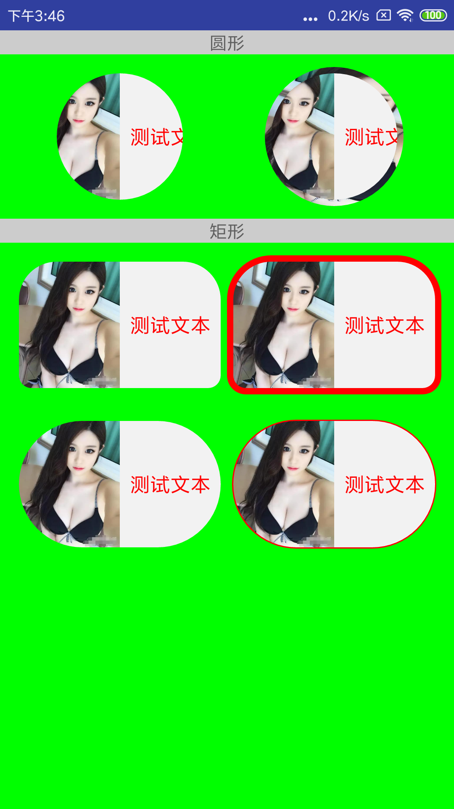

# 引入依赖

[  ](https://bintray.com/ulfyyang/ulfy-maven/shape-layout/_latestVersion)

```groovy
implementation 'com.ulfy.android.controls:shape-layout:x.x.x'
```

# 圆形

圆形不带边框

```xml
<com.ulfy.android.controls.ShapeLayout
    android:layout_width="wrap_content"
    android:layout_height="wrap_content"
    app:layout_shape="circle">
    
    ...
    
</com.ulfy.android.controls.ShapeLayout>
```

圆形带边框

```xml
<com.ulfy.android.controls.ShapeLayout
    android:layout_width="wrap_content"
    android:layout_height="wrap_content"
    android:padding="5dp"
    app:layout_shape="circle"
    app:shape_background="@drawable/meinv">
    
    ...
    
</com.ulfy.android.controls.ShapeLayout>

```

矩形不带边框

```xml
<com.ulfy.android.controls.ShapeLayout
    android:layout_width="wrap_content"
    android:layout_height="wrap_content"
    app:layout_shape="rect"
    app:rect_radius="10dp"
    app:rect_radius_left_top="30dp"
    app:rect_radius_right_top="30dp">
    
    ...
    
</com.ulfy.android.controls.ShapeLayout>

```

矩形带边框

```xml
<com.ulfy.android.controls.ShapeLayout
    android:layout_width="wrap_content"
    android:layout_height="wrap_content"
    android:layout_gravity="center"
    android:padding="5dp"
    app:layout_shape="rect"
    app:rect_radius="10dp"
    app:rect_radius_left_top="30dp"
    app:rect_radius_right_top="30dp"
    app:shape_background="#F00">
    
    ...
    
</com.ulfy.android.controls.ShapeLayout>
    
```

# 代码设置

```java
// 查找布局
ShapeLayout shapeSL = findViewById(R.id.shapeSL);

// 设置圆形
shapeSL.setShapeCircle();

// 设置矩形
shapeSL.setShapeRect(10);               // px
shapeSL.setShapeRect(10, 10, 10, 10);   // px

// 设置背景，如果显示边框需要设置padding
shapeSL.setShapeBackgroundColor(Color.BLUE);
shapeSL.setShapeBackgroundResource(R.drawable.meinv);
shapeSL.setShapeBackground(new ColorDrawable(Color.BLUE));
```
